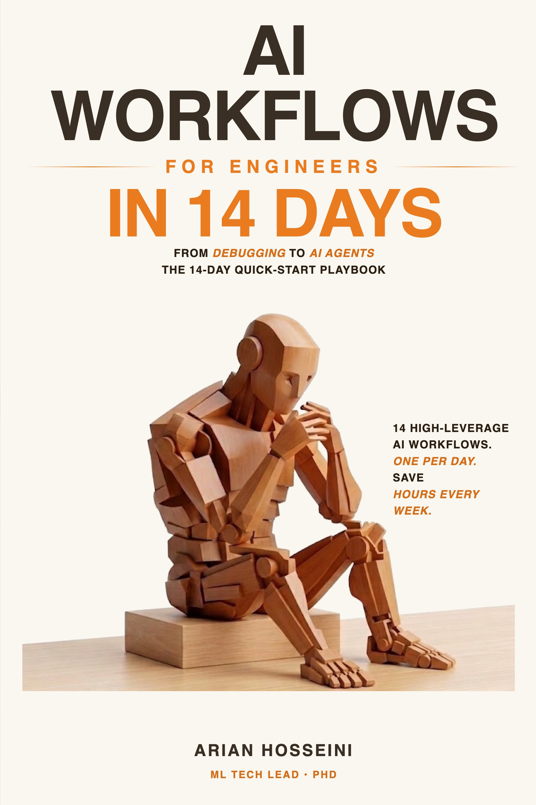

# AI Workflows for Engineers in 14 Days: From Debugging to AI Agents

Users' review:
> A solid, practical read. The debugging and PR workflows alone have already saved me a couple of hours this week.

<p align="center">
  
</p>

<p align="center">
  <strong>The 14-Day Quick-Start Playbook for engineers who want results, fast.</strong>
</p>

<p align="center">
  <a href="https://www.amazon.com/AI-Workflows-Engineers-Days-Debugging-ebook/dp/B0GX39Z8CH/ref=tmm_kin_swatch_0">📘 Get the Kindle eBook</a> · <a href="https://www.amazon.com/AI-Workflows-Engineers-Days-Debugging/dp/B0H2528MHY/ref=tmm_pap_swatch_0">📖 Get the Paperback</a>
</p>

<p align="center">
  ⭐ <em>If these workflows save you time, please consider starring this repo.</em>
</p>

---

## The Problem

The average engineer wastes **5 to 10 hours per week** on tasks AI could handle in minutes. Not because AI isn't capable. Because most engineers use it like a search engine — one question, one answer, move on.

The top 1% of engineers use AI like a **senior engineering partner**: multi-step workflows with specific prompts, structured outputs, and systematic integration into their daily work.

You don't have time for a 300-page playbook. This 14-day quick-start gives you the **14 highest-leverage AI workflows** from real production engineering. One workflow per day, ready to use the same hour you read it.

## What's Inside

14 practical, copy-paste-ready workflows — built around the tools you're already using: **Claude, ChatGPT, Cursor, Claude Code, and OpenClaw**.

| Day | Workflow |
|-----|----------|
| **1** | Turn vague tickets into clear implementation plans in 15 minutes |
| **2** | Generate useful PR descriptions from any diff |
| **3** | A 5-step debugging workflow that cuts diagnosis time by 75% |
| **4** | Find root causes from logs without reading 10,000 lines |
| **5** | Decode legacy code you didn't write (and nobody documented) |
| **6** | Vibe coding: when it works, when it breaks, and how to stay in control |
| **7** | Handle production incidents with AI by your side at 3am |
| **8** | Translate requirements into technical architecture drafts |
| **9** | Build LLM-as-Judge evaluation pipelines for AI quality at scale |
| **10** | Generate comprehensive test coverage in minutes |
| **11** | Build a personal AI assistant that knows your codebase |
| **12** | The multi-model strategy that top engineers use every day |
| **13** | Build AI agents with MCP, multi-agent orchestration, and OpenClaw |
| **14** | Build your own personal AI workflow system |

## Sample Workflows

### Day 1: Turn a Vague Ticket into an Implementation Plan

```
Here's my ticket:

Title: "Improve search performance"
Description: "Search is slow for some users. Look into it."

Break this into an implementation plan:
1. What questions do I need answered before writing code?
2. What are the likely root causes (ranked by probability)?
3. What's the investigation sequence?
4. For each likely cause, what's the fix and estimated effort?
5. What's the recommended approach and why?

Context: Python/Django app, PostgreSQL, ~2M records in the
search table, ElasticSearch for full-text search.
```

### Day 7: Incident Response in Real-Time

```
I'm responding to a production incident. Here's what I know:

Alert: API response time p99 > 5s (normally 200ms)
Started: 12 minutes ago
Services affected: user-api, search-service
Recent deployments: search-service deployed 45 min ago

Based on this information:
1. What's the most likely root cause?
2. What commands should I run to confirm?
3. What's the fastest path to mitigation?
4. Should I rollback immediately or investigate first?
```

### Day 9: Build an LLM-as-Judge Evaluation Pipeline

```
I need to evaluate my LLM application's output quality at scale.
Design an evaluation pipeline using the LLM-as-Judge pattern:

Application: Customer support chatbot
Quality dimensions to evaluate:
- Accuracy (factual correctness against our knowledge base)
- Helpfulness (does it actually solve the customer's problem?)
- Tone (professional, empathetic, not robotic)

For each dimension, design:
1. A scoring rubric (1-5 scale with specific criteria)
2. A judge prompt that evaluates responses consistently
3. A calibration method (how do I verify the judge is reliable?)
4. An aggregation strategy for overall quality scores
```

## Every Chapter Includes

- 🔧 **Step-by-step workflow** with copy-paste prompts
- ⚠️ **What goes wrong** — failure modes and how to handle them
- 📋 **Quick reference card** — use without re-reading the chapter
- 💡 **Real engineering stories** from production systems at scale

## Who This Book Is For

- Software engineers who use AI casually but want to be more systematic
- Anyone who wants results in two weeks, not two months
- Engineers tired of getting mediocre results from ChatGPT, Claude, or Copilot
- Tech leads onboarding teammates to AI-assisted workflows
- Anyone who's bought a 300-page tech book and never finished it

## Want the Full Playbook?

If these 14 workflows worked for you, the companion volume **[50 AI Workflows for Engineers: From Debugging to System Design, Code Review & Engineering Automation](https://www.amazon.com/Workflows-Engineers-Debugging-Engineering-Automation/dp/B0GZJNMY9C)** covers another 36 patterns: building knowledge bases, breaking down large tasks, code review at scale, requirements-to-architecture deep dives, database modeling, performance optimization, security scanning, threat modeling, RAG systems, prompt optimization, and the senior engineering patterns that compound over a career.

## About the Author

**Arian Hosseini, PhD** is an ML Tech Lead with 60+ papers and patents, an ACM Test-of-Time Award, and experience building production AI systems at Amazon, Microsoft, and other Fortune 500 companies.

## Links

- [Amazon Kindle](https://www.amazon.com/AI-Workflows-Engineers-Days-Debugging-ebook/dp/B0GX39Z8CH/ref=tmm_kin_swatch_0) · [Amazon Paperback](https://www.amazon.com/AI-Workflows-Engineers-Days-Debugging/dp/B0H2528MHY/ref=tmm_pap_swatch_0)
- [Companion volume: 50 AI Workflows for Engineers](https://www.amazon.com/Workflows-Engineers-Debugging-Engineering-Automation/dp/B0GZJNMY9C)

---

*Stop using AI casually. Start using it systematically — in 14 days.*
